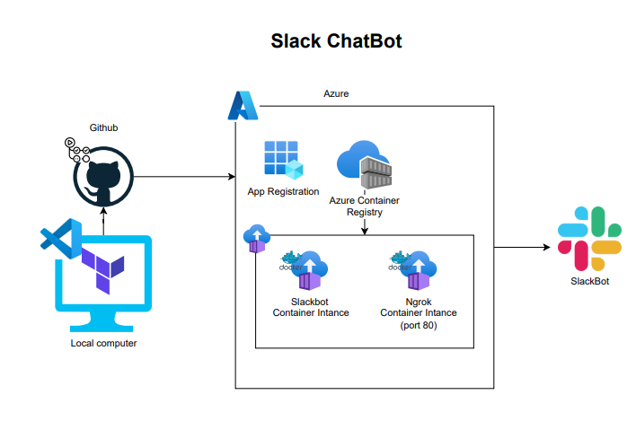

#####################################################
# what the IAC creates
#####################################################

# Slack Bot with ngrok in Azure Container Group



This project deploys a Slack bot application (https://tools.slack.dev/bolt-python/tutorial/getting-started-http/) and **ngrok** as separate containers in an Azure Container Group. The Slack bot listens on port 3000, and ngrok exposes this application to the internet using a public HTTPS endpoint.

## Architecture Overview

- **Slack Bot Container**: Runs the Slack bot application, listening on port 3000.
- **ngrok Container**: Creates a secure tunnel to expose the Slack bot container to the internet.
- **Azure Container Group**: Hosts both containers with shared networking.

## How It Works

1. **Slack Bot Container**:
   - Listens for incoming requests on port 3000.
   - Processes Slack interactions, such as event subscriptions or slash commands.

2. **ngrok Container**:
   - Authenticates using the provided `NGROK_AUTHTOKEN` environment variable.
   - Creates a public HTTPS tunnel that forwards traffic to the Slack bot container on port 3000.
   - The public ngrok URL is used in Slack's app configuration as the **Request URL**.

### Key Dockerfile Command for ngrok

The following `ENTRYPOINT` command in the ngrok container starts the tunnel:

```dockerfile
ENTRYPOINT ["ngrok", "http", "3000"]


# bolt_chatbot built on local machine for testing

az login

docker build -t cloud-career-roadmap-generator .

docker run -p 8501:8501 cloud-roadmap-generator

app should be accessible on http://localhost:8501

# to push to azure container registry from your local machine

docker build -t boltslackbotcontainerregistry.azurecr.io/slack-bot:latest .

docker push boltslackbotcontainerregistry.azurecr.io/slack-bot:latest

docker pull boltslackbotcontainerregistry.azurecr.io/slack-bot:latest

# if the image is not on the local machine it will be pulled from the acr

docker run -p 3000:3000 -e SLACK_BOT_TOKEN=$SLACK_BOT_TOKEN -e SLACK_APP_TOKEN=$SLACK_APP_TOKEN boltslackbotcontainerregistry.azurecr.io/slack-bot:latest

# Getting started with Bolt for Python

https://tools.slack.dev/bolt-python/getting-started

# Configuring OpenID Connect in Azure

https://docs.github.com/en/actions/security-for-github-actions/security-hardening-your-deployments/configuring-openid-connect-in-azure

# Configure a federated identity credential on an app

https://learn.microsoft.com/en-us/entra/workload-id/workload-identity-federation-create-trust?pivots=identity-wif-apps-methods-azp#configure-a-federated-identity-credential-on-an-app

# variables

### using, for example this - "echo "TF_VAR_azure_client_id=${{ secrets.AZURE_CLIENT_ID }}" >> $GITHUB_ENV"
### means that you don't have to hardcode any values into a local terraform tfvars config file
### The variable will be available for use in the github actions job

